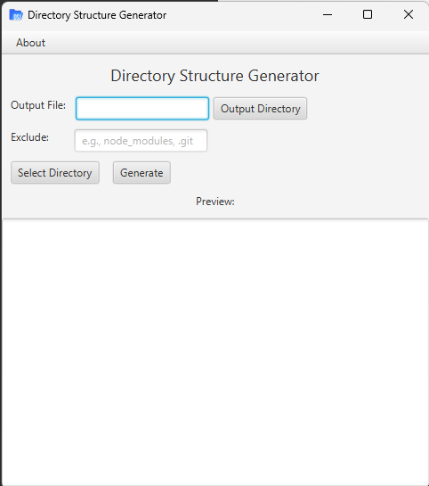

---

# **Directory Structure Generator**

---

## **About the Project**

**Directory Structure Generator** is a simple yet powerful application designed to create an ASCII representation of a directory structure. It is particularly useful for university students, developers, or anyone who needs a quick way to visualize and organize directory structures.

### **Key Features**
- Generate directory structures in ASCII format.
- Exclude specific files or directories from the output.
- User-friendly JavaFX interface for easy operation.
- Option to select the root directory and customize output location.
- Save generated directory structure to a file for future use.

---

## **Releases**
All releases are available in the [Releases](https://github.com/Pasanlaksitha/ProjectStructureGenerator/releases) section. Each version is thoroughly tested and includes new features or fixes as described in the release notes.

---

## **UI Preview**

### **Main Interface**
Here’s a sneak peek of the application in action:

---

## **Getting Started**
1. Download the latest release from the [Releases Page](https://github.com/Pasanlaksitha/ProjectStructureGenerator/releases).
2. Double-click the provided executable `.jar` file to launch the application.
3. Follow the instructions on the user interface to generate your directory structure.

---

## **How to Use**
### **Steps to Generate Directory Structure**
1. **Select Directory**: Click "Select Directory" to choose the root folder.
2. **Output Directory**: Specify where the output file will be saved.
3. **Exclude Directories/Files**: Add directories or files to exclude (e.g., `node_modules, .git`).
4. **Generate**: Click the "Generate" button to preview and save the directory structure.

---

## **Contributing**

Contributions are always welcome! If you'd like to enhance this project:
1. Fork the repository.
2. Create a feature branch (`git checkout -b feature-name`).
3. Commit your changes (`git commit -m 'Add some feature'`).
4. Push to your branch (`git push origin feature-name`).
5. Open a pull request.

---

## **License**

Distributed under the MIT License. See [`LICENSE`](LICENSE) for more information.

---

## **Author**

- **Pasan Laksitha**  
  [GitHub](https://github.com/Pasanlaksitha) | [LinkedIn](https://www.linkedin.com/in/pasanlaksitha)

---

## **Acknowledgments**
- JavaFX for UI development.
- Open-source contributors for inspiration and resources.
- University peers and mentors for feedback and suggestions.

---
